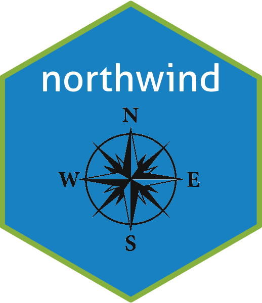

# northwind 

[](https://github.com/aephidayatuloh/northwind/actions/workflows/R-CMD-check.yaml)
[](LICENSE)
[](https://cran.r-project.org/package=northwind)

## Overview



**`northwind`** is an R package that provides easy access to the Northwind database — a classic dataset used for learning SQL, database design, business intelligence, and data analysis. This package offers the dataset in a tidy format and supports integration with tools like `tidyverse` and `tidymodels`.

It is ideal for:
- Teaching business analytics  
- Practicing joins and multi-table queries in R  
- Demonstrating data workflows in `tidyverse` or `tidymodels`

## Installation

You can install the development version from GitHub using either `devtools` or `pak`:

```
# Using devtools
install.packages("devtools")
devtools::install_github("aephidayatuloh/northwind")

# Or using pak
install.packages("pak")
pak::pak("aephidayatuloh/northwind")
````

## Available Tables

You can list all available tables using:

```
library(northwind)
northwind_list()
```

Example output:

| Table          | Description                             |
| -------------- | --------------------------------------- |
| customers      | Customer information                    |
| orders         | Sales order transactions                |
| order_details  | Details of each item in an order        |
| products       | List of available products              |
| categories     | Product categories                      |
| suppliers      | Product supplier information            |
| employees      | Employee details and reporting lines    |
| shippers       | Shipping service providers              |
| territories    | Sales territories assigned to employees |
| region         | Geographical regions                    |
| employees_territories | Mapping of employees to their sales territories |
| us_states      | Reference table for U.S. states         |


## Basic Usage

```
library(northwind)
library(dplyr)

# Load product data
products

# Join orders with customers
orders %>%
  left_join(customers, by = join_by(customer_id)) %>%
  count(country, sort = TRUE)
```

## Example: Top Selling Products

```
order_details %>%
  left_join(products, by = join_by(product_id)) %>%
  group_by(product_name) %>%
  summarise(total_revenue = sum(unit_price * quantity)) %>%
  arrange(desc(total_revenue)) %>%
  head(10)
```

## Example: Total Revenue by Country

``` 
library(northwind)
library(dplyr)

revenue_calc <- order_details %>%
  dplyr::mutate(revenue = unit_price * quantity * (1 - discount)) %>% 
  dplyr::left_join(orders, by = join_by(order_id)) %>% 
  dplyr::group_by(ship_country) %>% 
  dplyr::summarise(total_revenue = sum(revenue)) %>% 
  dplyr::arrange(desc(total_revenue))
revenue_calc
```

## Data Source

The **Northwind** database was originally created by Microsoft as a sample for demonstrating SQL Server and Microsoft Access capabilities. It is widely used for training and demonstrations in database systems, analytics, and business logic modeling.

## Contributing

Contributions are welcome! If you'd like to suggest improvements or report bugs, please open an issue or submit a pull request.

## License

This project is licensed under the MIT License. See the [LICENSE](LICENSE) file for details.

